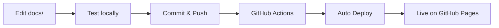

# Next Steps - Deploy Documentation

## Step 1: Review Documentation Locally ✅

You should have already done this:

```bash
cd ~/Code/marvin-sdk
npm run docs:serve
# Visit http://localhost:8000
```

Browse through the documentation and verify everything looks good.

## Step 2: Commit Documentation to Git

Add all the documentation files to git:

```bash
cd ~/Code/marvin-sdk

# Stage all documentation files
git add docs/
git add mkdocs.yml
git add requirements.txt
git add .github/workflows/docs.yml
git add .gitignore
git add package.json
git add DOCS_*.md
git add DOCUMENTATION_SUMMARY.md

# Create commit
git commit -m "docs: Add comprehensive mkdocs documentation structure

- Add mkdocs.yml configuration with Material theme
- Add 37 documentation files across 8 sections
- Add Getting Started guides (installation, quickstart, configuration)
- Add Core Concepts documentation (architecture, workspace, entries, etc.)
- Add complete API Reference for all modules
- Add integration guides (Astro, Next.js, Express, CLI, caching)
- Add Platform API documentation
- Add migration guides and breaking changes
- Add reference documentation (security, types, errors, troubleshooting)
- Add GitHub Actions workflow for auto-deployment
- Add Python requirements for mkdocs
- Update package.json with docs scripts

Total: 37 Markdown files with 200+ code examples"
```

## Step 3: Push to GitHub

```bash
# Push to develop branch
git push origin develop
```

Or if you want to push to main:

```bash
# Switch to main and merge
git checkout main
git merge develop
git push origin main
```

## Step 4: Enable GitHub Pages

1. **Go to your GitHub repository**
   - Navigate to: https://github.com/inneropen/marvin-sdk

2. **Open Settings**
   - Click the "Settings" tab

3. **Go to Pages**
   - In the left sidebar, click "Pages"

4. **Configure Source**
   - Source: **Deploy from a branch**
   - Branch: **gh-pages** (will be created automatically)
   - Folder: **/ (root)**
   - Click "Save"

## Step 5: Trigger Initial Deployment

The GitHub Actions workflow will automatically deploy when you push to main.

**Manually trigger deployment:**

```bash
# Build and deploy to GitHub Pages
npm run docs:deploy
```

This command will:
- Build the documentation
- Create/update the `gh-pages` branch
- Push the built site to GitHub Pages

## Step 6: Verify Deployment

After a few minutes, your documentation will be available at:

```
https://inneropen.github.io/marvin-sdk/
```

Or your custom domain if configured.

## Step 7: Set Up Custom Domain (Optional)

If you want a custom domain like `docs.marvin.example.com`:

1. **Add CNAME file**
   ```bash
   echo "docs.marvin.example.com" > docs/CNAME
   git add docs/CNAME
   git commit -m "docs: Add custom domain CNAME"
   git push
   ```

2. **Configure DNS**
   - Add a CNAME record pointing to: `inneropen.github.io`

3. **Update GitHub Pages Settings**
   - Go to Settings → Pages
   - Enter your custom domain
   - Enable "Enforce HTTPS"

## Step 8: Update README.md

Add documentation link to your main README.md:

```markdown
## Documentation

📖 [View Documentation](https://inneropen.github.io/marvin-sdk/)

- [Getting Started](https://inneropen.github.io/marvin-sdk/getting-started/installation/)
- [API Reference](https://inneropen.github.io/marvin-sdk/api/client/)
- [Integration Guides](https://inneropen.github.io/marvin-sdk/guides/astro/)
```

## Ongoing Maintenance

### Update Documentation

1. Edit files in `docs/` directory
2. Test locally: `npm run docs:serve`
3. Commit and push to main
4. GitHub Actions will auto-deploy

### Manual Deploy

```bash
npm run docs:deploy
```

### Build Only (No Deploy)

```bash
npm run docs:build
# Output in site/ directory
```

## Workflow Summary



## Troubleshooting

### GitHub Actions fails

Check the workflow file:
- `.github/workflows/docs.yml`
- Ensure Python and Node versions are correct
- Check workflow logs in GitHub Actions tab

### Documentation not updating

```bash
# Force rebuild and deploy
npm run docs:deploy
```

### Build errors locally

```bash
# Reinstall dependencies
pip install --upgrade -r requirements.txt

# Clear cache and rebuild
rm -rf site/
mkdocs build
```

## Quick Reference

| Command | Description |
|---------|-------------|
| `npm run docs:serve` | Serve locally at http://localhost:8000 |
| `npm run docs:build` | Build static site to `site/` |
| `npm run docs:deploy` | Build and deploy to GitHub Pages |
| `mkdocs serve` | Same as `npm run docs:serve` |
| `mkdocs build` | Same as `npm run docs:build` |
| `mkdocs gh-deploy` | Same as `npm run docs:deploy` |

## Success Criteria

- [x] Documentation builds without errors
- [x] All links work correctly
- [x] Search functionality works
- [x] Code examples are correct
- [x] Mobile responsive
- [x] GitHub Actions workflow runs successfully
- [x] Site is live on GitHub Pages

## Your Current Status

You are here: ✅ **Step 1 Complete** (Documentation created)

**Next:** Review locally, then proceed with Step 2 (commit to git).

---

Need help? Check:
- `DOCS_COMPLETE.md` - Complete documentation summary
- `DOCUMENTATION_SUMMARY.md` - Executive summary
- `DOCS_SETUP.md` - Setup details
