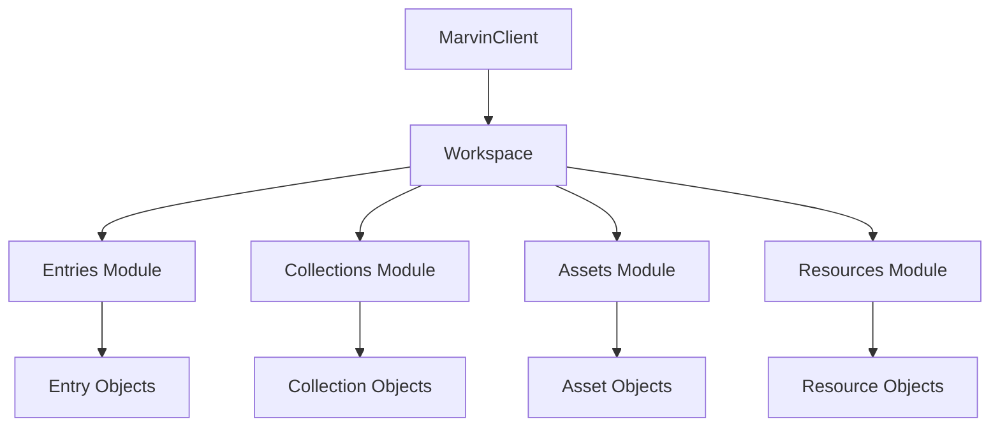

# Architecture

## Overview

The Marvin SDK is built with a **workspace-first architecture** that mirrors how you think about content in Marvin.



## Design Philosophy

The SDK is inspired by modern SDKs that prioritize developer experience:

- [Supabase JavaScript SDK](https://github.com/supabase/supabase-js)
- [Stripe SDK](https://github.com/stripe/stripe-node)
- [GitHub Octokit](https://github.com/octokit/octokit.js)

**Simple to start, powerful as you grow.**

Consumers think in **Marvin concepts** (Workspace, Entry, Collection), not raw REST endpoints.

## Modular Structure

The SDK is organized into focused modules:

```
@inneropen/marvin-sdk
├── client/       → Core client & HTTP
├── workspaces/   → Workspace object
├── entries/      → Entries module
├── collections/  → Collections module
├── assets/       → Assets module
├── resources/    → Resources module
├── platform/     → Platform API (admin, webhooks, etc.)
├── types/        → TypeScript types
└── core/         → Cache & utilities
```

## Core Layers

### 1. Client Layer

The entry point for all SDK operations:

```typescript
import { createMarvinClient } from '@inneropen/marvin-sdk';

const marvin = createMarvinClient({
  apiUrl: process.env.MARVIN_API_URL,
  siteClientToken: process.env.MARVIN_SITE_CLIENT_TOKEN,
  workspaceSlug: process.env.MARVIN_WORKSPACE_SLUG,
});
```

### 2. Workspace Layer

The workspace is the root object representing your Marvin workspace:

```typescript
const workspace = await marvin.getWorkspace();

// Cached site configuration
workspace.site?.title
workspace.site?.description

// Access modules
workspace.entries.list()
workspace.collections.get('slug')
workspace.assets.images()
workspace.resources.list()
```

### 3. Module Layer

Each module provides focused functionality:

- **Entries Module** - Content you create
- **Collections Module** - Organize and group entries
- **Assets Module** - Binary files and media
- **Resources Module** - Reusable structured objects

### 4. Object Layer

Rich objects with methods and properties:

```typescript
const entry = await marvin.entry('about-us');

// Properties
entry.title
entry.slug
entry.contentMarkdown

// Relationships
entry.assets
entry.collections
entry.resources

// Methods (future)
await entry.relatedEntries()
```

## Content Primitives

Marvin has four first-class content primitives:

### Entries

Content you create (pages, blog posts, projects):

```typescript
const entry = await marvin.entry('about-us');
```

[Learn more about Entries](entries.md)

### Collections

Organize and group entries:

```typescript
const collection = await marvin.collection('projects');
const entries = await collection.entries();
```

[Learn more about Collections](collections.md)

### Assets

Binary files and media:

```typescript
const images = await marvin.assets.images();
```

[Learn more about Assets](assets.md)

### Resources

Reusable structured objects:

```typescript
const resource = await marvin.resource('kuroki-s022');
const entries = await resource.entries();
```

[Learn more about Resources](resources.md)

## API Styles

The SDK supports three API styles to accommodate different use cases:

### 1. Workspace API (Recommended)

The workspace-first approach:

```typescript
const workspace = await marvin.getWorkspace();
const entries = await workspace.entries.list();
const collection = await workspace.collections.get('featured');
```

**Best for:**
- Understanding the full context
- Working with multiple modules
- Type-safe operations

### 2. Convenience API

Quick access to common operations:

```typescript
const entry = await marvin.entry('about');
const projects = await marvin.projects();
const pages = await marvin.pages();
```

**Best for:**
- Simple use cases
- Rapid prototyping
- Build scripts

### 3. Backwards-Compatible API

Legacy API support:

```typescript
const site = await marvin.getSite();
const entries = await marvin.getEntries();
const entry = await marvin.getEntry('about');
```

**Best for:**
- Migrating from older versions
- Maintaining existing code

## Caching Strategy

The SDK implements intelligent caching for performance:

- **Site configuration** is cached after initialization
- **Default cache duration:** 5 minutes
- **Automatic invalidation** on cache expiry
- **Manual control** via `loadSite()`

```typescript
const marvin = createMarvinClient({
  cacheDuration: 10 * 60 * 1000, // 10 minutes
});
```

[Learn more about Caching](../guides/caching.md)

## Type Safety

The SDK is fully typed with TypeScript:

```typescript
import type { Entry, Collection, Asset, Resource } from '@inneropen/marvin-sdk';

const entry: Entry = await marvin.entry('about');
const collection: Collection = await marvin.collection('projects');
```

[Learn more about Types](../reference/types.md)

## Future Modules

The architecture supports future expansion:

- ✅ **Publishing** - Implemented
- 🔜 **Authentication** - User authentication
- 🔜 **Users** - User management
- 🔜 **Workspaces** - Workspace management
- 🔜 **Events** - Event streams
- 🔜 **Webhooks** - Webhook management
- 🔜 **Search** - Full-text search
- 🔜 **AI** - AI-powered features

## Next Steps

- [Workspace Concept](workspace.md)
- [Entries Concept](entries.md)
- [Collections Concept](collections.md)
- [API Reference](../api/client.md)
